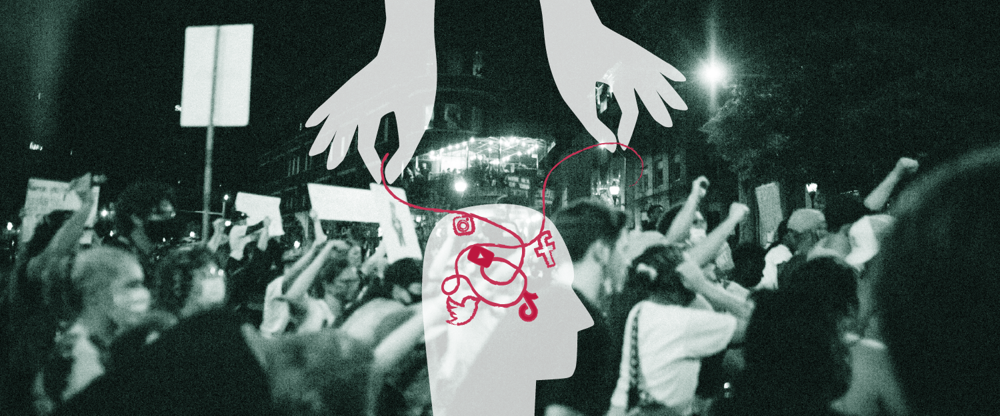

# The dangers of our information ecosystem

  

_banner : layout by Claudie M, photo by Kelly_

**Keywords**: digital identities, existencial risks, mass communication, sense-making, manipulation, institution, behaviour, social media, disinformation, echo chambers
  
## Introduction
Whether in our time or in the past, our behaviour has always been influenced by external factors, like the environment in which we live, the people around us, etc. Various entities such as companies, media outlets, and governments have the ability to shape our decision-making and discourage independent thought. The problem today is that since the invention of mass communication (the press, television), and then the Internet, these external players are increasingly omnipresent in our lives, whether we are aware of it or not, and have a major influence on the decisions we make.

So we can then ask ourselves : How does today’s mass communication, boosted by technology leads to existential risks? How can we be more aware of what information are thrown at us by companies, governments, and medias?

In this essay, we will first inform ourselves about the informational dangers inherent in our hyper-connected society, such as disinformation or the manipalutation of public opionion by major institutions, and the resulting creation of echo chambers. Then, we will focus on big companies and what they control, censor, and encourage. And finally, all this might help us understand how these actions can lead to humanity's downfall, by boosting internal conflicts or disputes between countries. All of these reflexions can then motivate us to develop our awareness of these issues so that we can better position ourselves in our society and be mindful of our choices.

## Threats to the Information Ecosystem
### Disinformation
Disinformation water down the quality of information available online. It can make it difficult to distinguish between reliable and unreliable sources, thereby weakening trust in traditional media and institutions.

In healthcare, disinformation can spread false information about vaccines, medical treatments or health crises. This can endanger public health by discouraging vaccination, encouraging risky behaviour or creating mistrust in the health authorities. For example, during the COVID crisis, social networks were in turmoil. With too much information being relayed, it can quickly become obsolete or simply irrelevant. What's more, a lot of influencers relayed a lot of information during this period. TalkWalker, an online social media surveillance programme, estimated that references to COVID-19 on social media reached 40.2 million times between May 12, 2020, and May 18, 2020. (M. Gottlieb, 2020)[^1]. Influencers, whether they work in the medical field or not, each have their own community and will further boost the circulation of rumours on social networks, such as whether or not to get vaccinated.

On top of all this, disinformation can lead to widespread mistrust, undermining social cohesion. When people are repeatedly exposed to false information, they can become more sceptical and less inclined to believe even factual, well-verified information. And when there are constant doubts about the accuracy of the information they receive, it can undermine the mutual trust necessary for a society to function properly. 

Misinformation can be countered by actions taken by the media, digital platforms and governments to promote accurate, diverse and transparent information. However, large institutions will sometimes use their power of moderation for their own ends.

### Manipulation of Public Opinion
The deployment of technology to influence behaviour has become an integral aspect of modern societies. For example, during the 2016 US presidential elections, foreign entities exploited social media platforms to spread disinformation, sow discord and influence public opinion. 

Social media has been increasingly analysed by a lot of countries for its perceptual management and psychological manipulation, which can be used as a war tool to shape ideas, redesign society, increase sensitivity, and strengthen social responses, ultimately weakening the administration, society, military, or economy of a country.  In 2011, the US Defense Advanced Research Projects Agency published a plan created with the sole aim of improving the digital presence of US forces and supporting them in guiding public opinion in a professional manner (Chen, L., Chen, J. and Xia, C.,2022)[^2]. The plan dates back more than 10 years and has undoubtedly been perfected over the years thanks to the development of new online social platforms.

Another more accessible example is the film 'Don't look up' on the Netflix platform. The film is a satire that tackles the theme of inaction in the face of an existential threat, symbolised by the discovery of a deadly comet heading for Earth. The issues at stake in the film highlight the difficulty of mobilising public attention on serious problems due to media manipulation, political indifference and social polarisation. While scientists predict the end of humanity, the President herself promotes a strategy of denial on social networks aimed at reassuring the population, with the sole aim of maintaining her power and her hold over the population. 

<iframe width="560" height="315" src="https://www.youtube.com/embed/JQERWWbnA5c?si=t3U8YDuNiRgYRCMI" title="YouTube video player" frameborder="0" allow="accelerometer; autoplay; clipboard-write; encrypted-media; gyroscope; picture-in-picture; web-share" allowfullscreen></iframe> 

The clip you can see is a good illustration of how institutions can distort reality and manipulate public opinion: all the President had to do in order to manipulate a whole section of the population was to boost their egos by making fun of those who are afraid, and by using an enticing slogan. It also shows the extent to which over-frequent use of social networks can lead to the polarisation of society, as in this movie, where we can see the population clearly divide itself into "belivers" and "non-believers".

### Echo chambers
Therefore algorithms, by calculating regularities in behaviour to establish a user profile, contribute to a form of isolation for Internet users. In reality, each person accesses a different version of the Web, which locks them into a "unique and optimised" bubble.

This can lead to an extreme polarisation of society : echo chambers foster a sense of group identity and solidarity among like-minded individuals, making it harder for them to question their beliefs or consider alternative perspectives.

Consider an individual with well-defined political views. If they only follow information sources that support their beliefs, the algorithms of social platforms will tend to present them with more similar content. Over time, this individual may find themselves immersed in an echo chamber where their opinions are constantly validated and reinforced, without being exposed to alternative perspectives. The individual's mind will then close in on their own beliefs, not only making their opinion even more powerful, but also no longer seeking out other points of view. If they are to confront another person with another point of view on a subject, they will clash with in surprisingly aggressive way,since they are sure that they are right. In the meantime, a more balanced majority remains silent [^3].

This polarisation of information can lead to deeper divisions within society, as individuals hold worldviews that are increasingly far apart. This can make constructive dialogue difficult and contribute to growing political and social polarisation.

## Control of Information by Institutions
### Power of the technological giants
Social networks, search engines, and messaging services are all owned by technological giants, such as Google, Facebook, Twitter, etc.
They have content moderation standards in place to filter material published on their platforms. They can eliminate content that is violent, hateful, or violates the platform's regulations. 

In several occasions, companies have been criticised for dubious censorship policies. For example, deleting certain political content, banning accounts, or limiting the exposure of specific speakers might be interpreted as acts of censorship, raising discussions over free expression.
These algorithms decide what information is shown to a user and have the ability to affect the media agenda by favouring certain issues over others. In this sense, technology behemoths have an impact on the visibility of specific content as well as the moulding of public opinion, which can create as we saw before echo chambers.

Sponsored tweets on Twitter, for example, although a legitimate online advertising tool, can potentially present risks and concerns relating to the manipulation of users' minds. Based on users' psychographic data, sponsored tweets can be targeted very precisely. This means that ads can be designed to tap into the emotions, beliefs, or specific preferences of each user, which can be perceived as subtle manipulation of thoughts and behaviours.

In general, most users recognise sponsored tweets and don't 'fall' into the trap of just reading them without trying to analyse them. 

  

  

However, as we can see from our two examples, sponsored tweets do provoke strong emotions in some users, such as anger or disgust. Without realising it, people can feed their negative emotions by spending just a little time - and sometimes just a few minutes - on Twitter. This will contribute to the radicalisation of opinions shared on the internet, generating waves of anger towards a government, an institution or a person.

In addition to all these effects, the advertisers behind sponsored tweets may have access to users' personal data, raising concerns about privacy and information security.

### Surveillance and Privacy

The collection of data on social media by companies raises major concerns about privacy. These technologies, often integrated into connected objects, enable constant monitoring of our activities, preferences and online interactions. A concrete example of this data collection is social commerce, where information gathered on user behaviour is used to personalise recommendations. According to the article "Investigating online social media users' behaviors for social commerce recommendations", social commerce connects sellers and consumers on websites and social platforms using the business concepts of online shopping and social networking (Liao, S.-H., Widowati, R. and Hsieh, Y.-C. , 2021)[^4]. Thus, data collection in the context of social commerce highlights the need to strike a balance between personalising shopping experiences and protecting users' privacy.

Social commerce platforms collect extensive user data, including browsing history, preferences, and interactions, to create detailed profiles for targeted advertising. Then, they can share this data with third-party advertisers that could increase the risk of unauthorized access or misuse. Some companies use tracking technologies, like cookies to monitor user behavior and analyse it to show more pertinent and personnalised information to eacher user.

Social commerce, by facilitating payments online, can encore more people to pay on social platform, which could be dangerous if those payment informations are revealed : in the event of a data breach, users' financial details may be compromised, leading to potential fraud or identity theft. 

If a large-scale accident linked to online user data were to occur, it would fuel fear and anger among online users, leading to discontent or even uprisings.
This is especially true given that user data can be enough to endanger a country internationally, among others various reasons.

### Esclation of tensions and existencial risks

Data collection can fuel tensions between countries in a number of ways, particularly in the context of cyber security, surveillance and espionage-related activities.  Governments may conduct cyber espionage operations to collect sensitive data on other nations (economic, political, military and technological information). Discovery of such activities can lead to diplomatic tensions and hostile responses between the countries involved.
In addition to this, international agreements, such as cybersecurity treaties, can be violated when countries carry out aggressive data collection activities. Such violations can lead to diplomatic disagreements and contribute to the escalation of tensions.

Misinformation has also a significant influence on international relations, contributing to the creation of misunderstandings, tensions and conflicts between nations. The impacts of disinformation include the deliberate dissemination of false information which can sow mistrust between countries, undermining the trust necessary for effective international cooperation. Disinformation campaigns can target global public opinion to influence perceptions and stir up anti-diplomatic sentiment. Information can also be manipulated by institutions for geopolitical purposes, for example to demonise other nations in times of conflict, creating a negative image of the opponent while creating narratives that support their objectives, whether by justifying military action, building alliances or winning international support. The article "Theorising digital disinformation in international relations" by Christina la Cour tells us an interesting story about disinformation [^5]: In 2016, a false story of mass sexual assault involving a German teenager, Lisa, claiming to have been assaulted by Arab refugees circulated in Germany. Despite protests from the German people in support of Lisa triggered before the public falsification by the public prosecutor, he eventually denied the story, revealing that the medical examination had found no evidence of sexual assault and also that Lisa had admitted to lying. Suspected of being Russian disinformation aimed at discrediting Angela Merkel, the case provoked strong reactions from German politicians towards Russia. In response, Germany created a strategic communications unit and introduced laws against fake news, highlighting digital disinformation as a major tool in international relations when propagated by ill-intentioned foreign powers.

 Collective misinformation can lead to mistrust of institutions , democratic processes and other foundations of society, resulting in social conflict, political instability and even crisis within a country itself. The spread of echo chambers on the internet divide communities, make constructive dialogue difficult and compromise society's ability to tackle common challenges. Trust is essential for institutions, governments and social interactions to function smoothly. If the population of a country does not trust their governement anymore, its country will no longer be properly managed, either economically or politically. Some groups within the population may also want to overthrow the government they no longer trust, leading to internal conflict and civil war.
In the event of an actual war, social media networks can serve as a tool for indirect offensives, encompassing covert media manipulation, dissemination of rumors, provocation of internal conflicts within the targeted party, and the spread of tension and negative emotions(Chen, L., Chen, J. and Xia, C.,2022) [^6].

## Conclusion

Our discussions have enabled us to understand how our current information system can represent a danger to humanity. First of all, by proving that disinformation and the creation of echo chambers are omnipresent in the digital world, and that these two phenomena are linked to a system of manipulation controlled by large institutions. Secondly, we analysed how technological giants influence public opinion using social networks.  Finally, after reflecting on the issues raised by our data on the net, we were able to consider the possible consequences of all these phenomena on national and international conflicts.

We are now faced with the task of finding and conceiving lasting solutions that will enable us to ensure our safety in the future, taking into account all the issues raised in our research.

### Areas for improvement and sense-making

To counter disinformation effectively, it is crucial to adopt an ojective approach by encouraging awareness and consciousness-raising, as Daniel Schmartenberger points out in his work on sense-making. Individuals need to be trained to critically examine sources of information, developing a capacity for analysis that strengthens their resilience in the face of information manipulation.

Similarly, international cooperation is essential in the fight against disinformation. Countries need to establish a culture of sharing information about disinformation campaigns. A decision of this kind would strengthen the collective ability to identify the tactics employed and implement coordinated countermeasures, thus creating a common defence against informational threats.

To achieve this goal, the creation of international standards and agreements could be a crucial step in building robust defences against disinformation on a global scale. These standards would provide common guidelines for nations, establishing a structured framework for cooperation to counter disinformation campaigns. International agreements strengthen collaboration and accountability, helping to contain the spread of false information.

Finally, transparency in communication between nations is a powerful remedy against disinformation. By encouraging an open and honest exchange of information, misunderstandings are dispelled and mutual understanding is strengthened. This transparency helps reduce vulnerability to misinformation by fostering an environment where facts are clearly presented, thereby limiting the opportunities for information to be exploited for malicious purposes.

## Image credit
Banner : photo by Kelly https://www.pexels.com/fr-fr/photo/gens-nuit-rue-sombre-4570692/

## References
[^1]: S;, G.M. (2020) Information and disinformation: Social media in the COVID-19 crisis, Academic emergency medicine : official journal of the Society for Academic Emergency Medicine. Available at: https://pubmed.ncbi.nlm.nih.gov/32474977/ (Accessed: 11 December 2023).
[^2]:Chen, L., Chen, J. and Xia, C. (2022) ‘Social network behavior and public opinion manipulation’, Journal of Information Security and Applications, 64, p. 103060. doi:10.1016/j.jisa.2021.103060.

[^3]:Reisach, U. (2021) ‘The responsibility of social media in times of societal and political manipulation’, European Journal of Operational Research, 291(3), pp. 906–917. doi:10.1016/j.ejor.2020.09.020.

[^4]:Liao, S.-H., Widowati, R. and Hsieh, Y.-C. (2021) ‘Investigating online social media users’ behaviors for Social Commerce recommendations’, Technology in Society, 66, p. 101655. doi:10.1016/j.techsoc.2021.101655.
[^5]:la Cour, C. (2020) ‘Theorising Digital Disinformation in international relations’, International Politics, 57(4), pp. 704–723. doi:10.1057/s41311-020-00215-x.
[^6]:Chen, L., Chen, J. and Xia, C. (2022) ‘Social network behavior and public opinion manipulation’, Journal of Information Security and Applications, 64, p. 103060. doi:10.1016/j.jisa.2021.103060.

